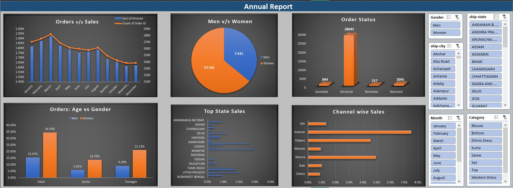

# Store – Annual Sales Analysis Dashboard

This project contains the full data analysis of Store annual performance.
It includes data cleaning, visualization, and insight generation using Excel dashboards.

# 📊 Project Overview

## This dashboard analyzes Vrinda Store’s sales performance across multiple dimensions:

Monthly Orders vs Sales

Gender-wise Performance

Age-group Analysis

Order Status Breakdown

State-wise Sales

Channel-wise Sales

Category-wise Sales

All visualizations are interactive with slicers for Month, State, City, Category, Gender, etc.

# 📁 Files Included

Store Data Analysis.xlsx – Raw data, cleaned data, pivot tables, and dashboard

Insight_Report.pdf – Short report with key business insights

README.md – Project documentation

# 🚀 Key Insights

Women contribute 64% of total sales (major customer segment)

Adults form the largest buyer group

Amazon is the highest-performing platform

Top states: Tamil Nadu, Karnataka, Delhi, Uttar Pradesh, West Bengal

Q1 (Jan–Apr) shows peak performance

High delivery success rate with low return/cancellation

# 📦 Tools Used

Microsoft Excel

Pivot Tables

Pivot Charts

Slicers

# Data Cleaning & Processing

##💡 How to Use

Download the Excel file.

Open the Dashboard sheet.

Use slicers to filter and explore insights.

Read the PDF for a summary of findings.

📧 Contact

For any improvements or suggestions, feel free to connect!
